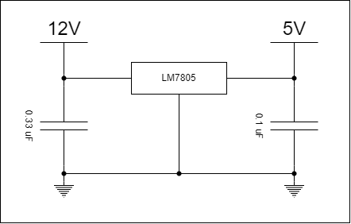
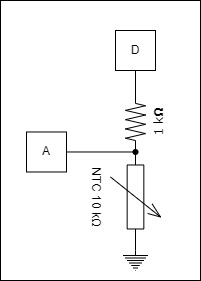
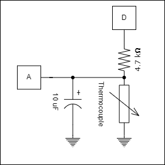
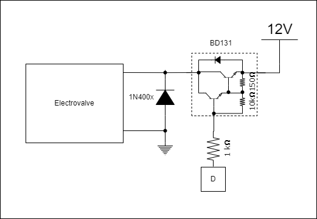
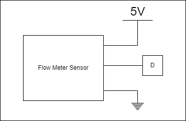

# Power Supply AC to 12V 1.5A

# Voltage Regulator 12V to 5V 1A

[LM7805 Datasheet](https://pdf1.alldatasheet.com/datasheet-pdf/view/82833/FAIRCHILD/LM7805.html)

# NTC thermistors circuits

10kOhm internal:

100kOhm external:

# ElectroValve Circuit

# Flow Meter Sensor

