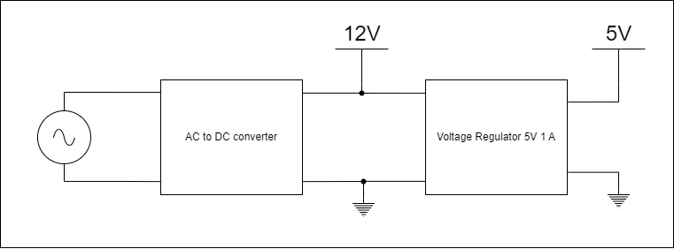

# Power Supply AC to 12V 1.5A

# Voltage Regulator 12V to 5V 1A

# NTC thermistors circuits

10kOhm internal:

100kOhm external:

# Arduino Uno and ESP8266-01

# Arduino Uno and SD Card Module

# Arduino Uno and I2C LCD Screen

# DOIT ESP32 DEVKIT V1 and ADS1115

# DOIT ESP32 DEVKIT V1 and SD Card Module

# DOIT ESP32 DEVKIT V1 and I2C LCD Screen

# ESP8266 NODE MCU and ADS1115

# ESP8266 NODE MCU and SD Card Module

# ESP8266 NODE MCU and I2C LCD Screen

# WeMos D1 mini and ADS1115

# WeMos D1 mini and SD Card Module

# WeMos D1 mini and I2C LCD Screen
