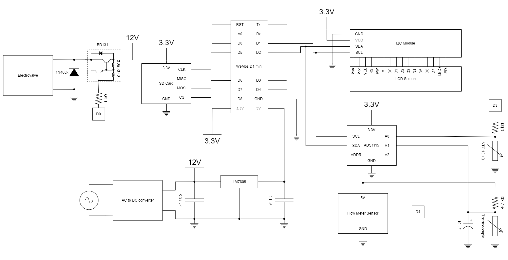

# smart-water-meter
A smart water meter project.

 # Results
 Reluts of temperature and water flow data with their matching diagrams
 

Components for all versions:

[Multimeter](https://meters.uni-trend.com/product/ut33plus-series/#Specifications)

[12V , 4.2A external switching power supply from Meanwell](https://grobotronics.com/12v-4.2a-50.4w-meanwell.html)

[12V Solenoid Valve , 1/2"](https://www.dfrobot.com/product-1530.html)

[water flow meter sensor , 1/2"](https://www.dfrobot.com/product-2608.html)

[NTC thermistor 10kOhm](https://www.tme.eu/en/details/tt4m10kc3t105/temperature-sensors-ntc/tewa-temperature-sensors/tt4m-10kc3-t105-1500/) / [Datasheet](https://www.tme.eu/Document/2fd18682537f203d4e1ff66aa471c66e/TT4-10KC3-T105-1500.pdf)

[Thermistor 100kOhm](https://www.aliexpress.com/item/32812361274.html?spm=a2g0o.productlist.0.0.6299625bJ9B6bk&algo_pvid=cde04796-a959-4abf-824a-91ee136e67ef&algo_exp_id=cde04796-a959-4abf-824a-91ee136e67ef-2&pdp_ext_f=%7B%22sku_id%22%3A%2264624873184%22%7D&aff_fcid=bda670e3113c429cb965c274fd3b2625-1682111249736-05190-_ANT75H&tt=CPS_NORMAL&aff_fsk=_ANT75H&aff_platform=portals-tool&sk=_ANT75H&aff_trace_key=bda670e3113c429cb965c274fd3b2625-1682111249736-05190-_ANT75H&terminal_id=33bdaae5a89d48faa3240971fed6191b&afSmartRedirect=y) / [Datasheet](https://www.tme.eu/Document/f9d2f5e38227fc1c7d979e546ff51768/NTCM-100K-B3950.pdf)

[Transistor BD136](https://grobotronics.com/transistor-pnp-45v-1.5a-bd136.html)

[SD card module](https://grobotronics.com/sd-card-breakout.html)

[I2C for LCD Module](https://grobotronics.com/ads1115-16-bit-adc-4-channel-with-programmable-gain-amplifier.html)

[LCD Screen 16x2](https://grobotronics.com/basic-16x2-character-lcd-white-on-blue-5v.html)

# Version with Arduino

Components:

[Arduino Uno](https://grobotronics.com/arduino-uno-compatible.html) or [Arduino Nano](https://grobotronics.com/arduino-nano-compatible-ch340-with-headers.html)

Sources:

[Arduino Uno and NTC](https://circuitdigest.com/microcontroller-projects/interfacing-Thermistor-with-arduino)

[Arduino Uno and Solenoid Valve](https://bc-robotics.com/tutorials/controlling-a-solenoid-valve-with-arduino/)

[Arduino Uno and ESP8266](https://www.instructables.com/Arduino-UNO-ESP8266-WiFi-Module/)

[Arduino Uno and SD Card](https://randomnerdtutorials.com/guide-to-sd-card-module-with-arduino/)

# Version with ESP32

Components:

[DOIT ESP32 DEVKIT V1](https://makeradvisor.com/tools/esp32-dev-board-wi-fi-bluetooth/) or [ESP32  DEVKIT V1](https://grobotronics.com/esp32-development-board-devkit-v1.html)

[ADS1115 (ADC 16-bit)](https://grobotronics.com/ads1115-16-bit-adc-4-channel-with-programmable-gain-amplifier.html)

Sources:

[DOIT ESP32 DEVKIT V1 and SC Card Module](https://randomnerdtutorials.com/esp32-microsd-card-arduino/)

[DOIT ESP32 DEVKIT V1 and ADS1115](https://microcontrollerslab.com/ads1115-external-adc-with-esp32/)

# Version with ESP8266

Components:

[WeMos D1 mini Pro ESP8266 (V1.0)](https://grobotronics.com/wemos-d1-mini-pro-esp8266-v1.0-4mbytes.html) or [ESP8266 NODE MCU](https://grobotronics.com/nodemcu-lua-based-esp8266.html)

[WeMos D1 mini and external Power Supply](https://diyi0t.com/esp8266-wemos-d1-mini-tutorial/?utm_content=cmp-true)

[ADS1115 16-bit ADC](https://grobotronics.com/ads1115-16-bit-adc-4-channel-with-programmable-gain-amplifier.html)

Sources:

[ESP8266 NODE MCU and ADS1115](https://how2electronics.com/expanding-esp8266-analog-pin-with-ads1115-16-bit-adc/)

[ESP8266 NODE MCU and SD Card Module](https://www.instructables.com/SD-Card-Module-With-ESP8266/)

[WeMos D1 mini and ADS1115](http://www.esp8266learning.com/ads1115-analog-to-digital-converter-and-esp8266.php)

[WeMos D1 mini and SD Card](https://www.instructables.com/Using-the-Wifi-D1-Mini-Real-time-Clock-and-Logger/)

[WeMos D1 mini and I2C for LCD Screen](https://microdigisoft.com/how-to-use-i2c-lcd-with-esp8266-wemos-d1-mini/)

[WeMos D1 mini and ADS1115 and NTC thermistor](https://blog.meteodrenthe.nl/2022/08/07/getting-accurate-ntc-thermistor-readings-with-a-wemos-d1-mini/)

# Protocols

[I2C vs SPI](https://www.totalphase.com/blog/2021/07/i2c-vs-spi-protocol-analyzers-differences-and-similarities/)

[ESP8266-01 and I2C](https://www.instructables.com/ESP8266-01-With-Multiple-I2C-Devices-Exploring-ESP/)

# Logging Data with SD Card

[Writing in SD Card a .csv file](https://rydepier.wordpress.com/2015/08/07/using-an-sd-card-reader-to-store-and-retrieve-data-with-arduino/)

# Monitoring using Online Platform

[Thinger.io Platform](https://thinger.io/)

# Statistical Analysis

[T-Test](https://www.researchgate.net/post/Hot_to_compare_performances_of_two_sensors)

[Compare Data of Time Series](https://www.researchgate.net/post/How-should-I-compare-temperature-time-series-data-between-two-experiments)

[Covariance / Correlation for Time Series](https://journal.r-project.org/archive/2016/RJ-2016-049/RJ-2016-049.pdf)

[Exponential Filter](https://www.megunolink.com/documentation/arduino-libraries/exponential-filter/)

# Scientific Report

[Matrix Education](https://www.matrix.edu.au/how-to-write-a-scientific-report/)

[University of Wisconsin - Madison](https://writing.wisc.edu/handbook/assignments/sciencereport/)

[DEAKIN University](https://www.deakin.edu.au/students/study-support/resources-and-referencing/academic-skills/writing-a-scientific-report)

[THE UNIVERSITY of NORTH CAROLINA at CHAPEL HILL](https://writingcenter.unc.edu/tips-and-tools/scientific-reports/)

[The University of WAIKATO](https://www.waikato.ac.nz/library/guidance/guides/write-scientific-reports)

